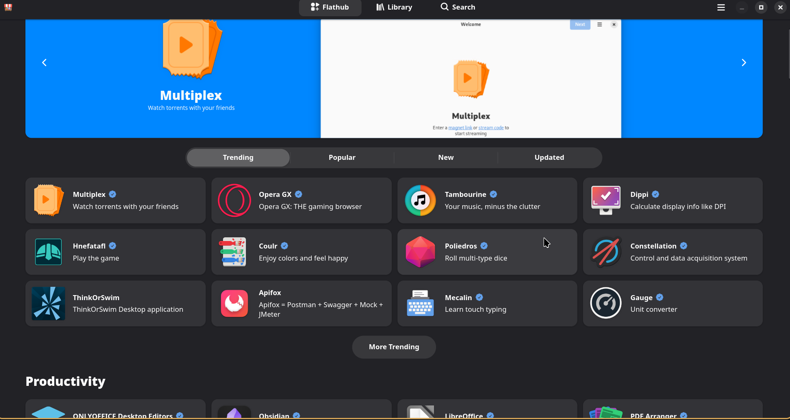

<h2 id="为什要使用-flatpak-">为什要使用 <a href="https://flathub.org/" target="_blank" rel="noopener nofollow">Flatpak</a> 🤔</h2>

在 Linux 下装软件，除了系统包管理器（<code>apt</code>/<code>pacman</code>/<code>dnf</code>）和 Snap，还有越来越流行的 Flatpak。它解决了依赖冲突和发行版碎片化的问题 🎉

<table>
<thead>
<tr>
<th style="text-align: left">优点</th>
<th style="text-align: left">解释</th>
</tr>
</thead>
<tbody>
<tr>
<td style="text-align: left">跨发行版兼容 🌍</td>
<td style="text-align: left">同一个 Flatpak 应用可以在不同的 Linux 发行版上运行</td>
</tr>
<tr>
<td style="text-align: left">沙盒安全 🔒</td>
<td style="text-align: left">应用运行在受限的环境中，增强系统安全性</td>
</tr>
<tr>
<td style="text-align: left">依赖隔离 📦</td>
<td style="text-align: left">应用自带所需依赖，避免与系统库冲突</td>
</tr>
<tr>
<td style="text-align: left">版本控制 🔄</td>
<td style="text-align: left">支持并行安装同一应用的不同版本</td>
</tr>
</tbody>
</table>
<blockquote>

无论你是寻找应用的用户，还是希望触达更多用户的开发者，Flathub 都是 Linux 应用的最佳选择 ✨

</blockquote>

<h2 id="安装-flatpak-️">安装 Flatpak 🛠️</h2>

Flatpak 支持几乎所有 Linux 发行版，安装请参考官网： 
<a href="https://flatpak.org/setup/" target="_blank" rel="noopener nofollow">https://flatpak.org/setup/</a>

这里是 Arch Linux 的安装方法 🐧

<pre><code class="language-bash"># 安装 flatpak
sudo pacman -S flatpak

# 安装完后… 其实不用重启，重新登录终端即可 😉
# 如果你非要保险，也可以 reboot（但没必要）
</code></pre>

<h2 id="添加-flatpak-的软件仓库-flathub-">添加 Flatpak 的软件仓库 Flathub 📂</h2>

Flathub 是最大的 Flatpak 应用中心 🎯

<pre><code class="language-bash"># 添加官方镜像
flatpak remote-add --if-not-exists --user flathub https://dl.flathub.org/repo/flathub.flatpakrepo

# 验证远程仓库
flatpak remotes
</code></pre>

对于国内网络限制导致下载速度的问题 🚦，如果没有魔法，可尝试更换为国内镜像。 
这里推荐 <a href="https://mirrors.ustc.edu.cn/help/flathub.html" target="_blank" rel="noopener nofollow"><strong>中科大镜像</strong></a> 🇨🇳

<pre><code class="language-bash"># 添加国内镜像源
flatpak remote-modify flathub --url=https://mirrors.ustc.edu.cn/flathub

# 如果想恢复官方源
flatpak remote-modify flathub --url=https://dl.flathub.org/repo
</code></pre>

<h2 id="图像化-gui-商店-️">图像化 GUI 商店 🖼️</h2>

如果不想安装软件，可以直接去 flatpak 官网🔗查找应用 
<a href="https://flathub.org/" target="_blank" rel="noopener nofollow">https://flathub.org/</a> 
<strong>GNOME Software</strong> / <strong>KDE Discover</strong>：默认集成 Flatpak 支持，安装后即可在 GUI 中搜索安装 🎨

如果你用窗口管理器（比如 i3、awesome、dwm，niri，hyprland），这里推荐 <strong>Bazzar</strong> 🛒

<pre><code class="language-bash">flatpak install flathub io.github.kolunmi.Bazaar
flatpak run io.github.kolunmi.Bazaar
</code></pre>

下载好后，就可以打开开始用了！ 🚀

<h2 id="_"></h2>
<h2 id="基础命令行-cli-使用方法-">基础命令行 CLI 使用方法 💻</h2>

如果你是一个喜欢命令行工作但人，可以学习这些😉。

<pre><code class="language-bash"># 查看 flatpak 版本 🧐
flatpak --version

# 搜索应用程序 🔍
flatpak search 应用名

# 安装应用 📥
flatpak install applicationID   # 记得前面加上仓库名，比如 flathub

# 列出已安装应用 📋
flatpak list           # 所有
flatpak list --app     # 仅应用，不含运行时
flatpak list --runtime # 仅运行时

# 更新应用 ⬆️
flatpak update

# 卸载应用 🗑️
# 卸载，但保留用户数据（数据在 ~/.var/app/ 下）
flatpak uninstall applicationID
# 卸载，不保留用户数据（彻底拜拜 👋）
flatpak uninstall applicationID --delete-data

# 清理缓存 🧹
flatpak uninstall --unused           # 卸载未使用的 Flatpak 应用程序
flatpak uninstall --unused --runtime # 卸载未使用的 Flatpak 运行时
</code></pre>