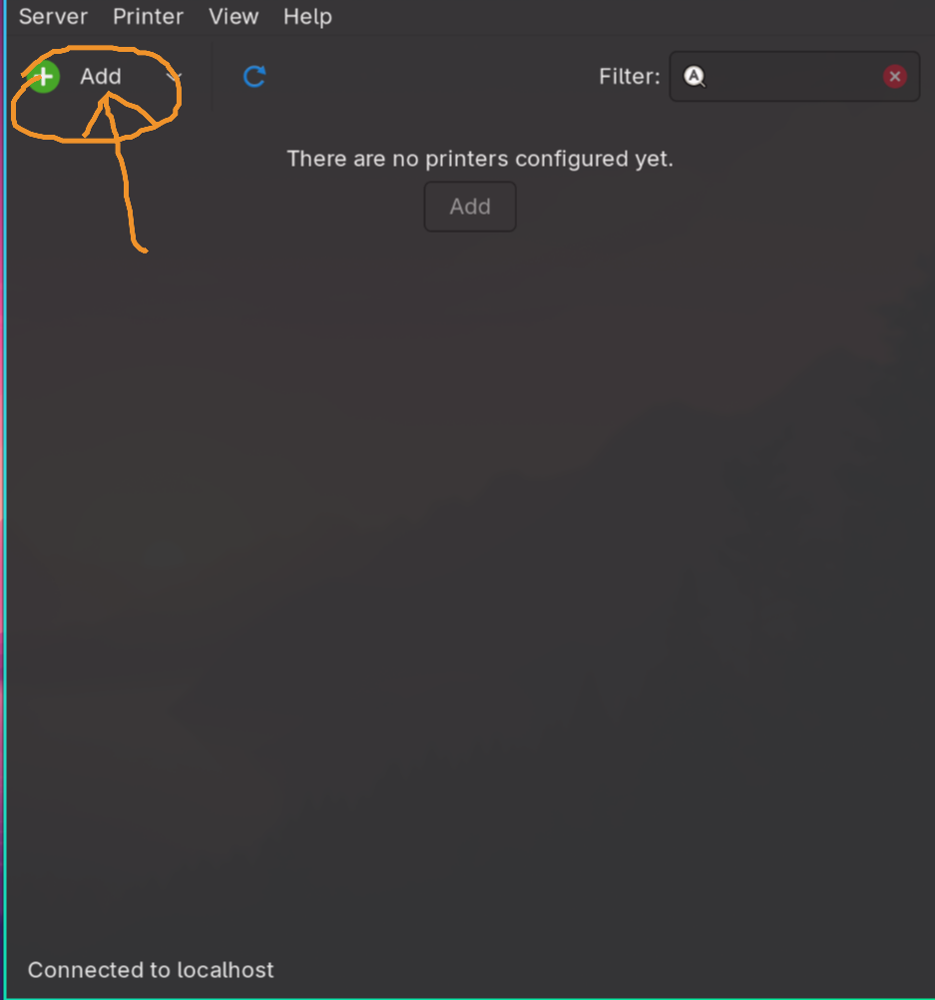
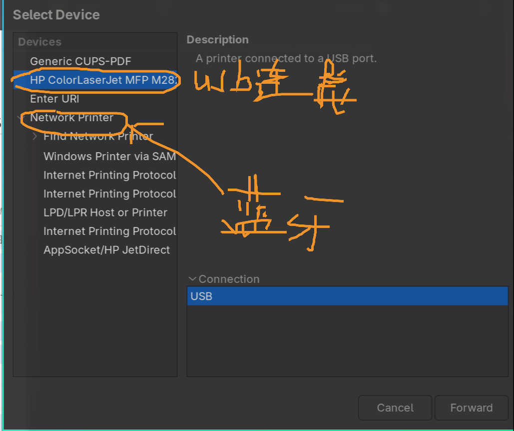
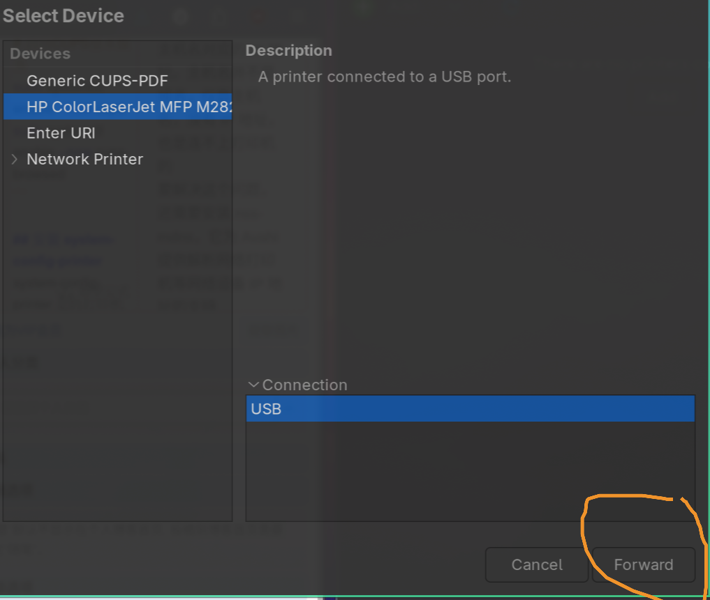
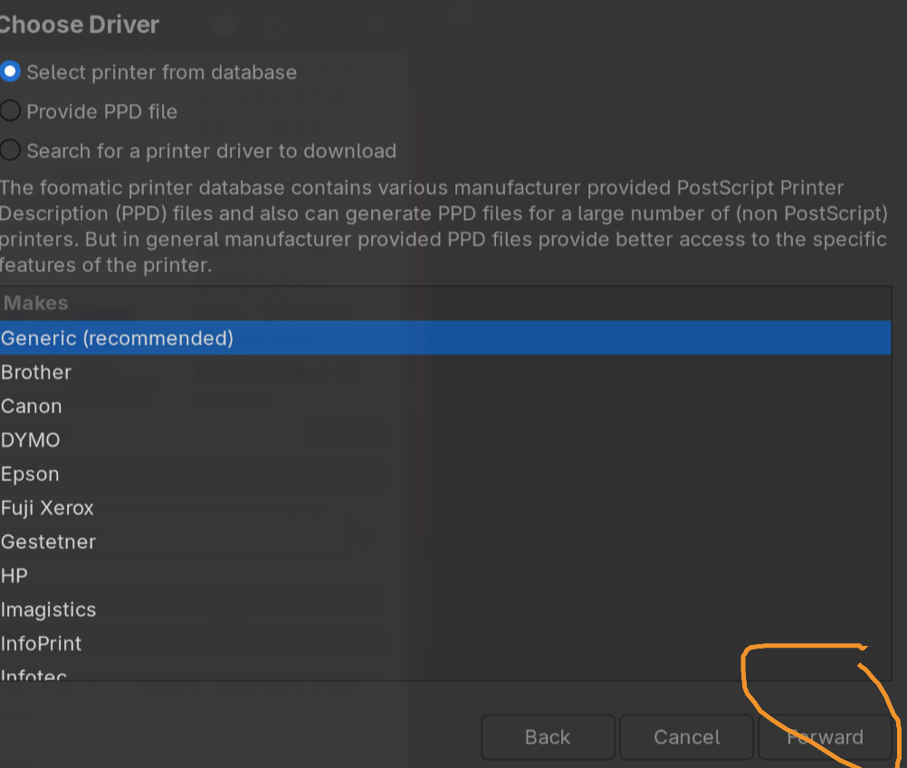
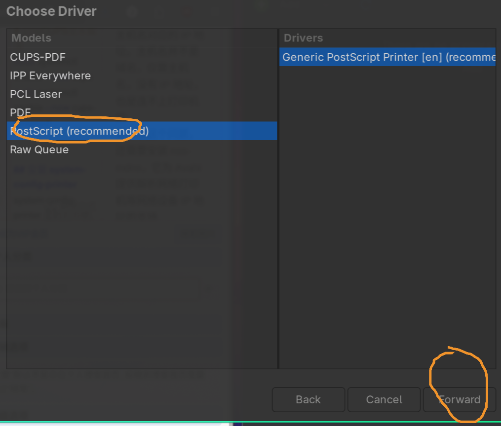
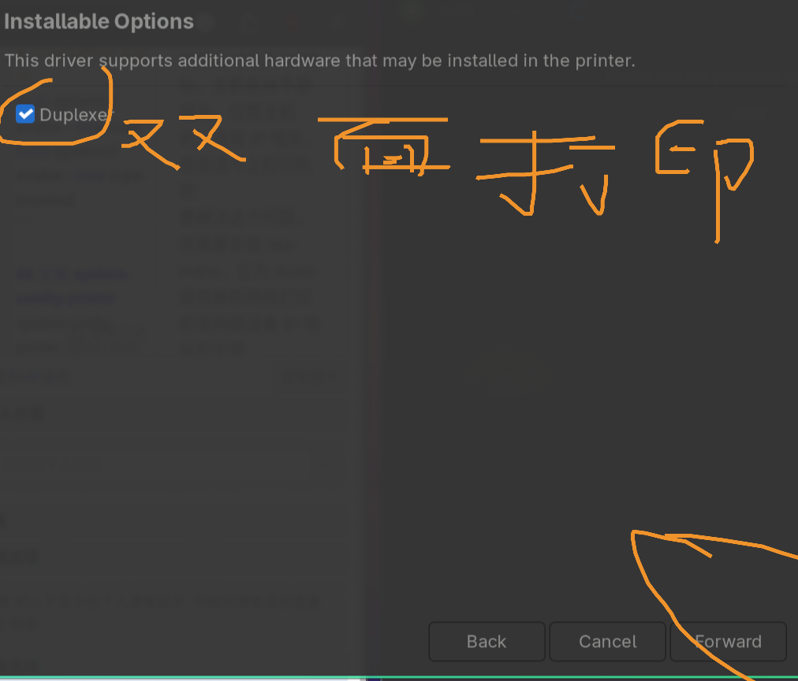
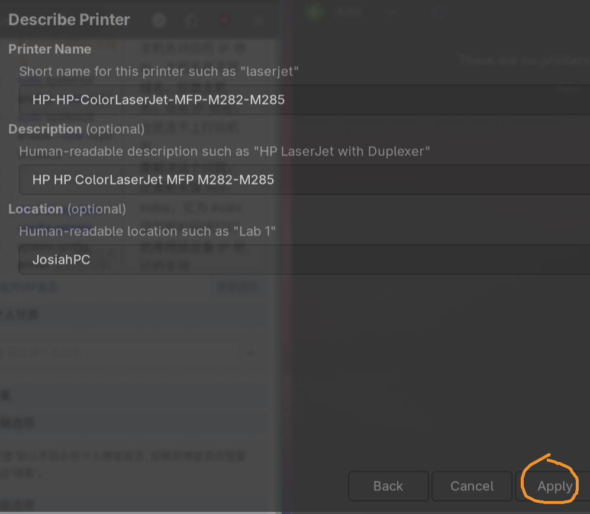

Linux 下缺少打印机驱动是常见问题。Linux 在打印方面确实不如 windows 即插即用方便，配置步骤还是颇为复杂的，请各位耐心观看本文。

<h2 id="安装-cpus">安装 CPUS</h2>

<a href="https://baike.baidu.com/item/cups/13007261#" target="_blank" rel="noopener nofollow">不了解什么是cpus的可以看这里</a>

安装 CUPS 服务：

<pre><code class="language-bash"># Arch Linux / Manjaro / Omarchy
sudo pacman -Sy cups cups-browsed bluez-cups cups-pdf

# Debian / Ubuntu / Deepin
sudo apt update
sudo apt install cups cups-browsed bluez-cups cups-pdf

# OpenSUSE
sudo zypper install cups cups-browsed bluez-cups cups-pdf

# Fedora
sudo dnf install cups cups-browsed bluez-cups cups-pdf
</code></pre>

启动 CUPS 服务：

<pre><code class="language-bash"># 启用CUPS基本服务
sudo systemctl enable --now cups
sudo systemctl enable --now cups-browsed
</code></pre>
<h2 id="安装-system-config-printer">安装 system-config-printer</h2>

system-config-printer 是的打印机管理工具，由 RedHat 团队开发

<pre><code class="language-bash"># Arch Linux / Manjaro / Omarchy
sudo pacman -Sy system-config-printer

# Debian /OmarchyUbuntu / Deepin
sudo apt update
sudo apt install system-config-printer

# OpenSUSE
sudo zypper install system-config-printer

# Fedora
sudo dnf install system-config-printer
</code></pre>
<h2 id="安装-nss-mdns">安装 nss-mdns</h2>

CUPS 使用 Avahi 来搜索网络打印机，但在有的电脑上，光有 Avahi 还不够。CUPS 能搜索到打印机，但是只能解析打印机的主机名，无法解析主机名对应的 IP 地址。主机名并不是域名，仅靠主机名，没有 IP 地址，也是连不上打印机的 
要解决这个问题，还需要安装 nss-mdns，它为 Avahi 提供解析网络打印机等网络设备 IP 地址的支持

<pre><code class="language-bash"># Arch Linux / Manjaro / Omarchy
sudo pacman -Sy nss-mdns

# Debian / Ubuntu / Deepin
sudo apt update
sudo apt install libnss-mdns

# OpenSUSE
sudo zypper install nss-mdns

# Fedora
sudo dnf install nss-mdns
</code></pre>
<h2 id="安装-foomatic-db">安装 Foomatic-db</h2>

Foomatic-db：收集的有关 XML 文件中打印机、驱动程序和驱动程序选项的知识，foomatic-db-engine 用于生成 PPD 文件。

<pre><code class="language-bash"># Arch Linux / Manjaro / Omarchy
sudo pacman -Sy foomatic-db foomatic-db-ppds

# Debian / Ubuntu / Deepin
sudo apt update
sudo apt install foomatic-db foomatic-db-compressed-ppds
sudo apt install foomatic-filters

# Fedora
sudo dnf install foomatic-db foomatic-db-ppds foomatic-db-filesystem
</code></pre>
<h2 id="配置打印机">配置打印机</h2>

这样就可以连接上打印机，在system-config-printer配置，进行打印了。如果说蓝牙打印机在 system-config-printer中network printer设置即可 
 
 
 
 
 
 
 
 
最后可以选择打印测试，看看打印机是否可使用
