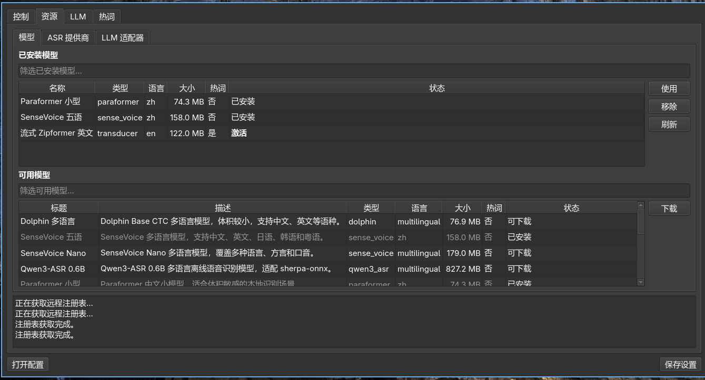
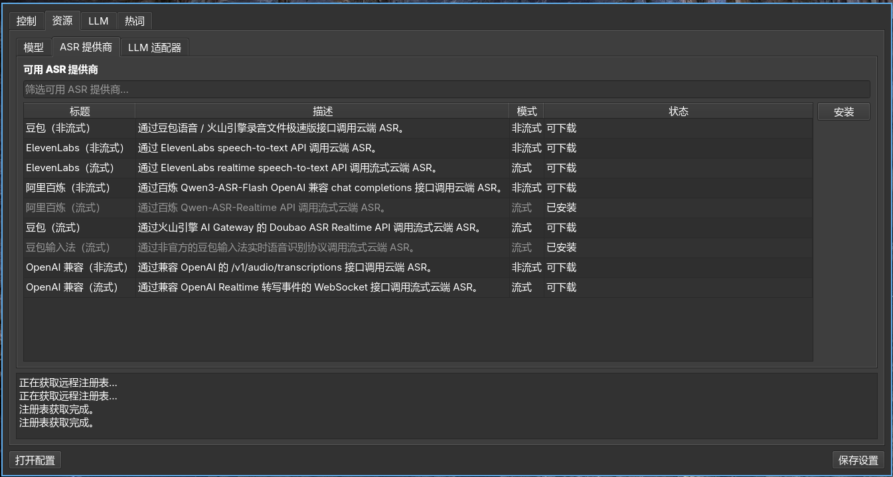

<h2 id="安装-vinput-前的准备">安装 vinput 前的准备</h2>
<ul>
<li>确保你已经安装配置好 <strong>fcitx5</strong></li>
<li>确保你的麦克风能正常使用</li>
</ul>
<h2 id="安装并启用-vinput">安装并启用 Vinput</h2>
<h3 id="各发行版安装方法">各发行版安装方法</h3>
<h4 id="flatpak-通用推荐">Flatpak （通用，推荐）</h4>
<pre><code class="language-bash">flatpak remote-add --if-not-exists xifan https://xifan2333.github.io/flatpak-auto/xifan.flatpakrepo
flatpak install https://xifan2333.github.io/flatpak-auto/refs/org.fcitx.Fcitx5.Addon.Vinput.flatpakref

# 安装后额外授权
flatpak override --user --filesystem=xdg-run/pipewire-0 org.fcitx.Fcitx5
flatpak override --user --filesystem=xdg-config/systemd:create org.fcitx.Fcitx5
flatpak override --user --filesystem=xdg-cache org.fcitx.Fcitx5
flatpak kill org.fcitx.Fcitx5
</code></pre>
<h4 id="archlinux">Archlinux</h4>
<pre><code class="language-bash">yay -S fcitx5-vinput-bin
</code></pre>
<h4 id="fedora">Fedora</h4>
<pre><code class="language-bash">sudo dnf copr enable xifan/fcitx5-vinput-bin
sudo dnf install fcitx5-vinput
</code></pre>
<h4 id="ubuntu">Ubuntu</h4>
<pre><code class="language-bash">sudo add-apt-repository ppa:xifan233/ppa
sudo apt update
sudo apt install fcitx5-vinput
</code></pre>
<h4 id="debian">Debian</h4>
<pre><code class="language-bash">sudo dpkg -i fcitx5-vinput_*.deb
sudo apt-get install -f
</code></pre>
<h4 id="nixos">NixOS</h4>
<pre><code class="language-nix"># flake.nix
inputs.fcitx5-vinput.url = "github:xifan2333/fcitx5-vinput";

nixConfig = {
  extra-substituters = [ "https://fcitx5-vinput.cachix.org" ];
  extra-trusted-public-keys = [
    "fcitx5-vinput.cachix.org-1:XpX3AA6+dDIX4qJhb1QM7sbTwX6/qSlGvW8Z5NK6XdU="
  ];
};
</code></pre>
<h3 id="启动服务">启动服务</h3>

安装好之后启用 vinput 服务：

<pre><code class="language-bash"># 启动后台守护进程
systemctl --user enable --now vinput-daemon.service
# 重新加载 Fcitx5
fcitx5 -r
</code></pre>
<h3 id="在-fcitx5-中启用">在 Fcitx5 中启用</h3>

打开 Fcitx5 配置 → 附加组件 → 找到 Vinput → 启用。

<h3 id="安装模型">安装模型</h3>
<h4 id="图形-gui">图形 GUI</h4>
<ol>
<li>

打开 Vinput GUI（从应用菜单启动，或在终端运行 vinput-gui）。

</li>
<li>

进入 资源 → 模型，在可用模型列表中选择需要的模型，点击 下载 安装，然后点击 使用 激活。

</li>
</ol>
<h3 id="终端-cli">终端 CLI</h3>
<pre><code class="language-bash">vinput model list -a            # 浏览可用模型
vinput model add &lt;模型名&gt;        # 下载并安装
vinput model use &lt;模型名&gt;        # 设置为当前模型
</code></pre>

也可手动将模型目录放到 ~/.local/share/vinput/models/&lt;模型名&gt;/，目录内需包含： 
<code>vinput-model.json</code> 
<code>model.int8.onnx</code> 或 <code>model.onnx</code> 
<code>tokens.txt</code>

<h4 id="本地模型">本地模型</h4>

<h4 id="云端-asr">云端 ASR</h4>

<h3 id="开始使用">开始使用</h3>
<h4 id="按键说明">按键说明</h4>
<table>
<thead>
<tr>
<th style="text-align: center">按键</th>
<th style="text-align: center">默认</th>
<th style="text-align: left">功能</th>
</tr>
</thead>
<tbody>
<tr>
<td style="text-align: center">触发键</td>
<td style="text-align: center">Alt_R</td>
<td style="text-align: left">短按切换录音；长按即说即停</td>
</tr>
<tr>
<td style="text-align: center">命令键</td>
<td style="text-align: center">Control_R</td>
<td style="text-align: left">选中文本后按住，语音指令修改选中内容</td>
</tr>
<tr>
<td style="text-align: center">ASR 菜单键</td>
<td style="text-align: center">F8</td>
<td style="text-align: left">打开 ASR 提供商 / 模型切换菜单</td>
</tr>
<tr>
<td style="text-align: center">场景菜单键</td>
<td style="text-align: center">Shift_R</td>
<td style="text-align: left">打开场景切换菜单</td>
</tr>
<tr>
<td style="text-align: center">翻页</td>
<td style="text-align: center">Page Up / Page Down</td>
<td style="text-align: left">候选列表翻页</td>
</tr>
<tr>
<td style="text-align: center">移动</td>
<td style="text-align: center">↑ / ↓</td>
<td style="text-align: left">候选列表移动光标</td>
</tr>
<tr>
<td style="text-align: center">确认</td>
<td style="text-align: center">Enter</td>
<td style="text-align: left">确认选中候选</td>
</tr>
<tr>
<td style="text-align: center">取消</td>
<td style="text-align: center">Esc</td>
<td style="text-align: left">关闭菜单</td>
</tr>
<tr>
<td style="text-align: center">快选</td>
<td style="text-align: center">1–9</td>
<td style="text-align: left">快速选择候选</td>
</tr>
</tbody>
</table>

所有按键均可在 Fcitx5 配置界面中自定义。
