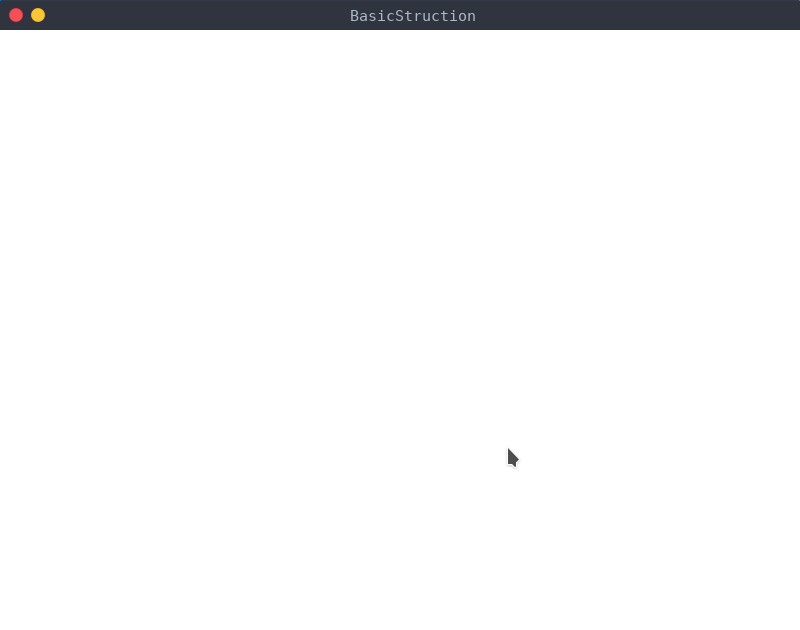

<h2 id="pygame-的介绍">Pygame 的介绍</h2>

pygame 是用来写游戏的 python 模块集合。使用 python 可以导入 pygame 来开发有意思的游戏。pygame 小巧并且跨平台。

<h2 id="安装-pygame">安装 pygame</h2>
<pre><code class="language-bash"># 如果安装速度慢，可以使用换源安装
pip install pygame
# 另一种方法
python -m pip install --user pygame 
</code></pre>
<h2 id="基本开发框架">基本开发框架</h2>
<pre><code class="language-python">import sys

import pygame # 导入 pygame 包

if __name__ == '__main__':
    pygame.init() # 各功能模块进行初始化创建及变量设置
    size = width, height = 800, 600 # 设置窗口大小
    screen = pygame.display.set_mode(size) # 初始化显示窗口
    pygame.display.set_caption('MinStruction') # 设置窗口标题
    screen.fill((255, 255, 255)) # 设置窗口背景色
    while True: # 游戏循环
        for event in pygame.event.get(): #从 Pygame 的事件队列中取出事件，并从队列中删除该事件
            # 获得事件类型，并逐类响应
            if event.type == pygame.QUIT: 
                sys.exit() #用于退出结束游戏并退出
            elif event.type == pygame.KEYDOWN:
                if event.key == pygame.K_q: # 按 Q 键退出
                    sys.exit()
        pygame.display.flip() # 对显示窗口进行更新，默认窗口全部重绘
</code></pre>

运行效果应该是这样

若想全屏可使用如下代码替换上面的7，8行:

<pre><code class="language-python">    # 全屏
    screen = pygame.display.set_mode((0, 0), pygame.FULLSCREEN)
    # 获取屏幕 size
    width = screen.get_rect().width
    height = screen.get_rect().height
    size = width， height
</code></pre>