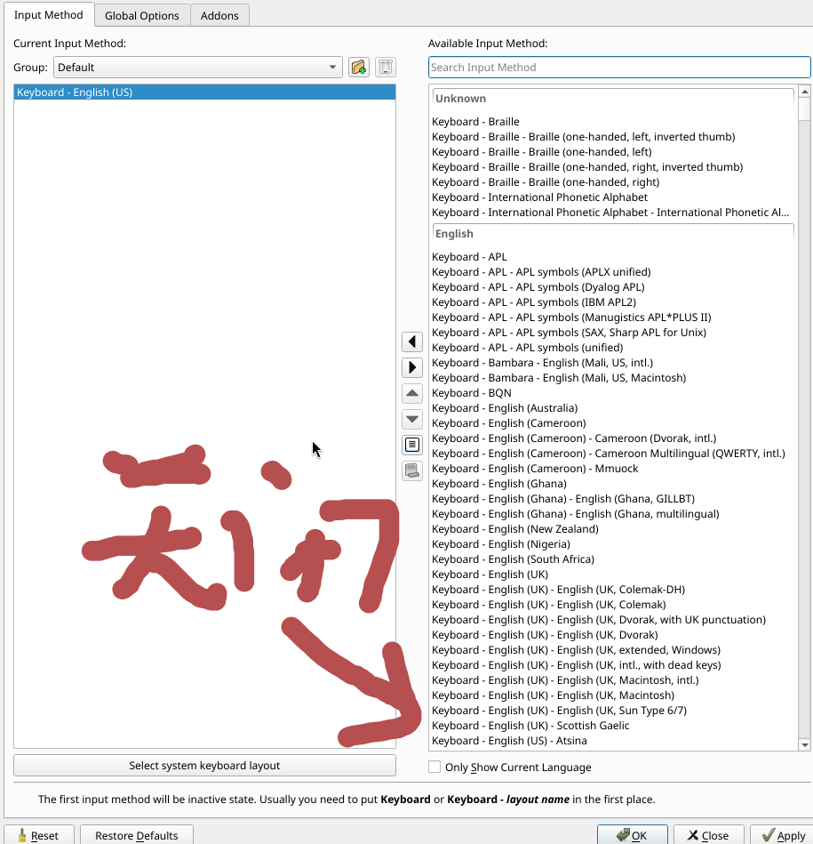
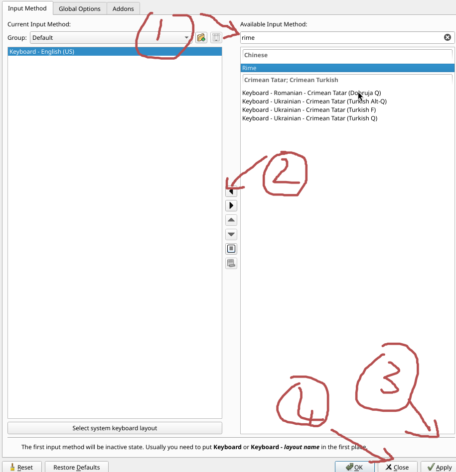
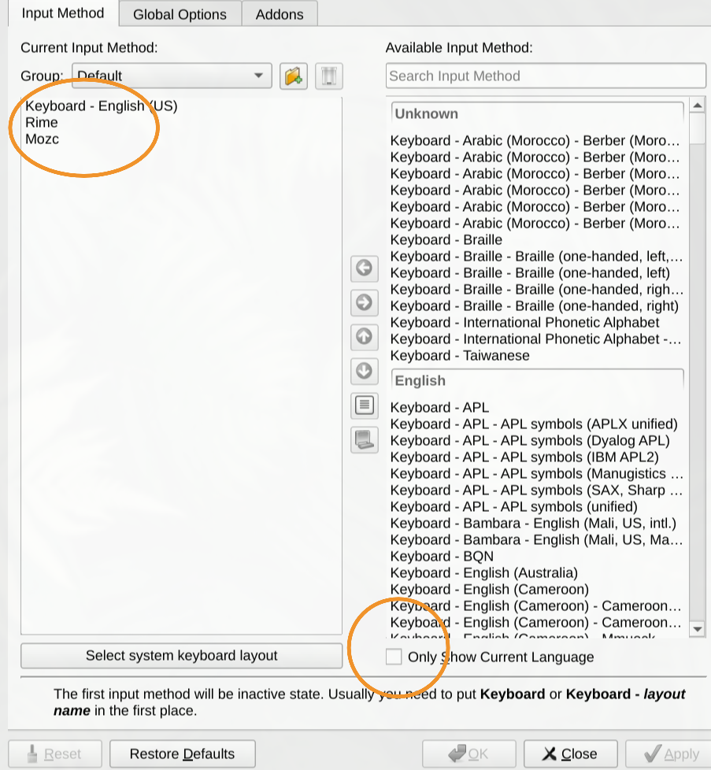
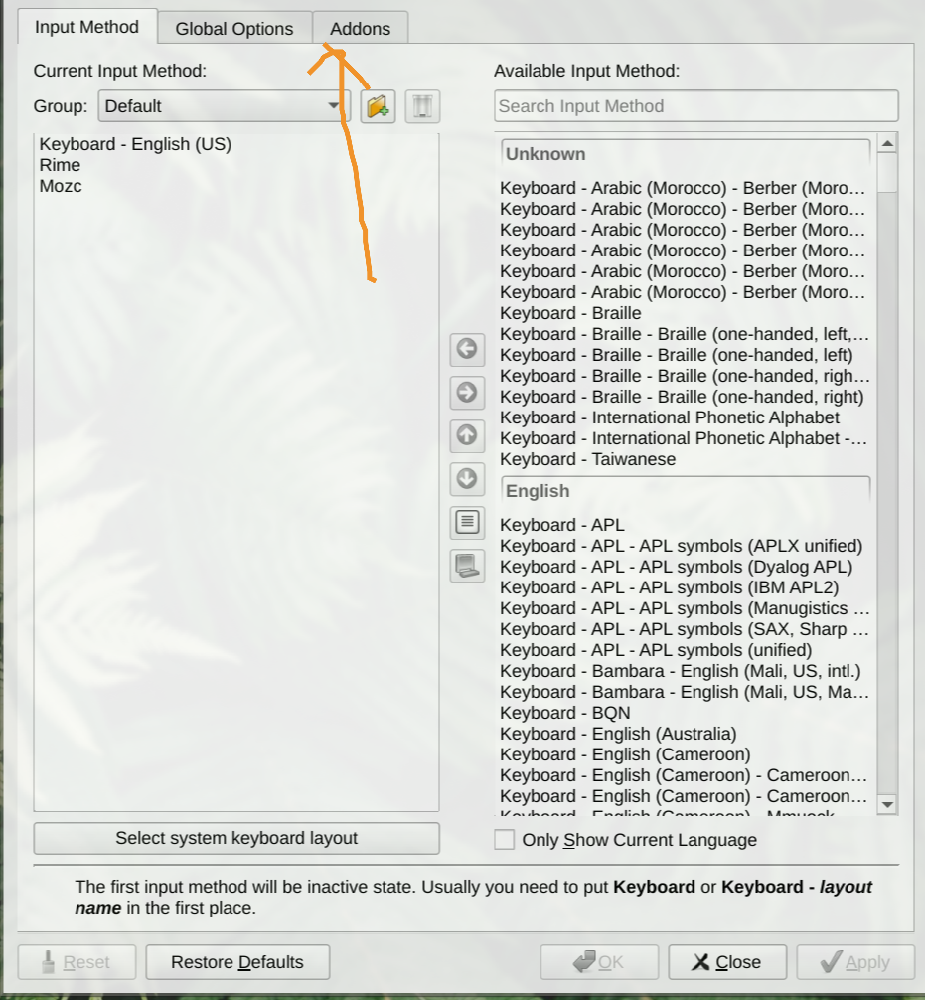
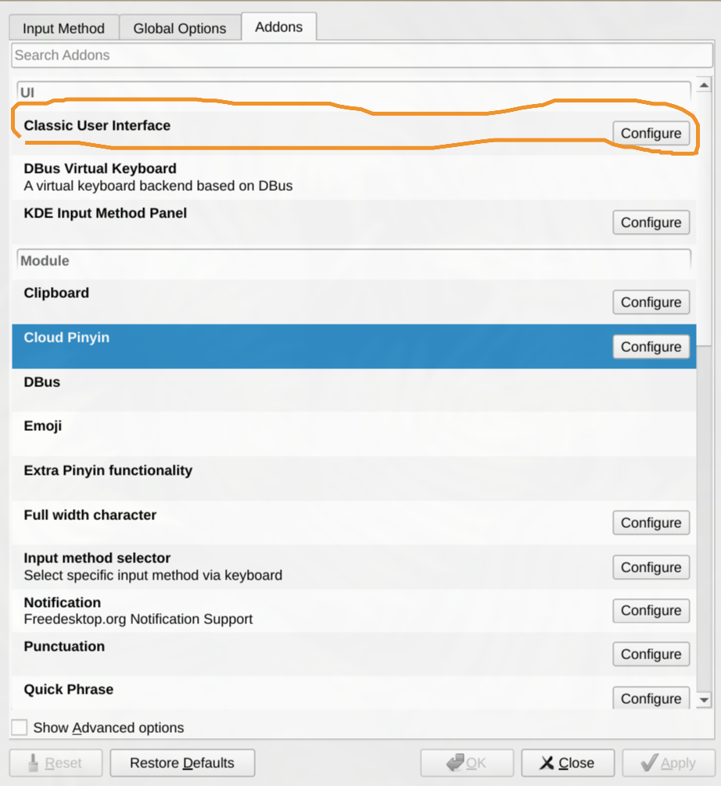
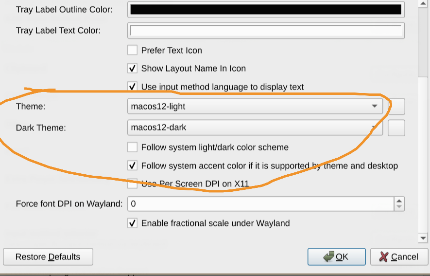

<h2 id="安装及配置输入法框架">安装及配置输入法框架</h2>
<h3 id="安装输入法框架">安装输入法框架</h3>

目前一共有两种选择Fcitx5和Ibus，这里推荐使用更现代，轻量Fcitx5

<pre><code class="language-bash"># 中文
# Fcitx5
sudo pacman -S fcitx5 fcitx5-chinese-addons fcitx5-gtk fcitx5-qt fcitx5-configtool
# Ibus
sudo pacman -S ibus ibus-rime

# 日语
# Fcitx5
sudo pacman -S fcitx5 fcitx5-mozc fcitx5-gtk fcitx5-qt fcitx5-configtool
# Ibus
sudo pacman -S ibus ibus-mozc
</code></pre>
<h3 id="设置环境变量">设置环境变量</h3>

编辑 ~/.pam_environment（全局）或 ~/.xprofile（仅X/Wayland）

<pre><code># Fcitx5

export GTK_IM_MODULE=fcitx5
export QT_IM_MODULE=fcitx5
export XMODIFIERS=@im=fcitx5

# IBus

export GTK_IM_MODULE=ibus
export QT_IM_MODULE=ibus
export XMODIFIERS=@im=ibus
</code></pre>
<h3 id="安装输入法">安装输入法</h3>

在终端执行

<pre><code class="language-bash"># Fcitx5
fcitx5-configtool
# Ibus
ibus-setup
</code></pre>

进入软件后添加 Rime（中文）和 Mozc（日语）输入法 
 

<h2 id="安装字体">安装字体</h2>
<h3 id="中文字体">中文字体</h3>
<pre><code class="language-bash">sudo pacman -S adobe-source-han-sans-cn-fonts
</code></pre>

可选的字体有

<ul>
<li>adobe-source-han-sans-cn-fonts</li>
<li>adobe-source-han-serif-cn-fonts</li>
<li>noto-fonts-cjk</li>
<li>wqy-microhei</li>
<li>wqy-microhei-lite</li>
<li>wqy-bitmapfont</li>
<li>wqy-zenhei</li>
<li>ttf-arphic-ukai</li>
<li>ttf-arphic-uming</li>
</ul>
<h3 id="日语字体">日语字体</h3>
<pre><code class="language-bash">sudo pacman -S adobe-source-han-sans-jp-fonts
</code></pre>

可选的字体有

<ul>
<li>adobe-source-han-sans-jp-fonts</li>
<li>adobe-source-han-serif-jp-fonts</li>
<li>noto-fonts-cjk</li>
<li>otf-ipafont</li>
<li>otf-ipaexfont</li>
<li>ttf-hanazono</li>
<li>ttf-jigmo</li>
<li>ttf-sazanami</li>
<li>ttf-koruriAUR</li>
<li>ttf-monapoAUR</li>
<li>ttf-mplus-gitAUR</li>
<li>ttf-vlgothic</li>
<li>ttf-kanjistrokeordersAUR</li>
</ul>
<h2 id="中文输入法优化">中文输入法优化</h2>
<h3 id="安装框架">安装框架</h3>

中文输入合集 fcitx5-chinese-addons 功能过于简陋 
推荐这两种方案：万象 雾凇 
全拼推荐使用雾凇，双拼推荐使用万象

<pre><code># 雾凇
sudo pacman -S fcitx5-rime rime-ice-git
# 万象
sudo pacman -S rime-wanxiang-pinyin rime-wanxiang-flypy

# 如果你用五笔
sudo pacman -S rime-wubi
</code></pre>

安装好后，打开 fcitx5-configtool 添加 rime 到输入法列表中，完成后重启输入法。

<h3 id="修改默认输入方案">修改默认输入方案</h3>

下面我们编辑配置配置文件将默认输入方案改成雾凇拼音

<pre><code class="language-bash"># 编辑配置文件启用 RIME 雾凇拼音

mkdir -p ~/.local/share/fcitx5/rime
vim ~/.local/share/fcitx5/rime/default.custom.yaml
</code></pre>

写入以下内容设置 rime 的默认方案为雾凇拼音：

<pre><code>patch:
  # 这里的 rime_ice_suggestion 为雾凇方案的默认预设
  __include: rime_ice_suggestion:/
</code></pre>

重启输入法之后默认输入方案就变成雾凇拼音了

<h3 id="配置输入法模型">配置输入法模型</h3>

推荐给雾凇拼音接入万象的语法模型，可以提高长句联想效果 
<a href="https://github.com/amzxyz/RIME-LMDG/releases/download/LTS/wanxiang-lts-zh-hans.gram" target="_blank" rel="noopener nofollow">https://github.com/amzxyz/RIME-LMDG/releases/download/LTS/wanxiang-lts-zh-hans.gram</a>

<pre><code class="language-bash"># 安装模型
# 直接从 AUR 或者 archlinuxcn 安装 或者从 GitHub 手动下载,下载完成后把模型放在 ~/.local/share/fcitx5/rime/。
yay -S rime-wanxiang-gram-zh-hans
</code></pre>
<pre><code class="language-bash"># 编辑雾凇拼音的配置文件
vim ~/.local/share/fcitx5/rime/rime_ice.custom.yaml
</code></pre>

写入下面内容

<pre><code>patch:
    grammar/language": wanxiang-lts-zh-hans
</code></pre>

重新启动输入法即可生效

<h2 id="安装输入法皮肤">安装输入法皮肤</h2>

浏览器搜索 fcitx5 themes，下载自己喜欢的主题, 放到 <code>~/.local/share/fcitx5/themes</code> 目录下。 
当然也可以在 archlinux 的 aur 中搜索，找自己喜欢的主题 
例如我要使用macos主题

<pre><code class="language-bash">yay -S fcitx5-theme-macos12
</code></pre>

下载好后在fcitx5的addons中选择UI栏中的 Classic User Interface, 更改theme你下载的主题

