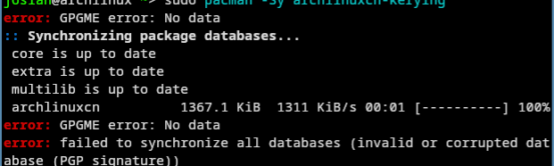

<h2 id="archlinuxcn简介">Archlinuxcn简介</h2>
<blockquote>

ArchLinuxCN 是由 Arch Linux 中文社区维护的非官方用户存储库。它旨在为 Arch Linux 用户，尤其是华语社区的用户，提供对 Arch Linux 官方存储库中不可用的常用软件、工具、字体和自定义包的访问权限。

<ol>
<li>它包括中国用户经常使用的软件和工具，如字体和美化包</li>
<li>它由 Arch Linux 中文社区维护，以满足官方存储库未涵盖的特定需求</li>
</ol>
</blockquote>
<h2 id="更换国内-pacman-镜像源">更换国内 pacman 镜像源</h2>

为保证下载速度，可以切换国内镜像源l

<pre><code class="language-bash">sudo pacman -S reflector
sudo reflector --country China --latest 10 --protocol https --sort rate --save /etc/pacman.d/mirrorlist
</code></pre>
<h2 id="添加archlinuxcn-软件仓库">添加archlinuxcn 软件仓库</h2>

编辑 /etc/pacman.conf， 在文件最后加入下面内容：

<pre><code class="language-bash">[archlinuxcn]
Server = https://mirrors.tuna.tsinghua.edu.cn/archlinuxcn/$arch
Server = https://mirrors.tuna.tsinghua.edu.cn/archlinuxcn/$arch
</code></pre>

然后安装 archlinuxcn-keyring 包，导入 GPG key。

<pre><code class="language-bash">sudo pacman -Sy archlinuxcn-keyring：
</code></pre>
<h2 id="faq-解答">FAQ 解答</h2>

若前一次由于网络问题，更新失败，导致下面问题：： 
 
可以试试如下解决方案：

<pre><code class="language-bash"># 清理损坏的缓存和残留密钥
sudo rm -rf /var/lib/pacman/sync/*
sudo rm -rf /etc/pacman.d/gnupg
# 重新初始化 keyring
sudo pacman-key --init
sudo pacman-key --populate archlinux
#强制刷新
sudo pacman -Syy 
# 再次安装keyring
sudo pacman -S archlinuxcn-keyring
</code></pre>